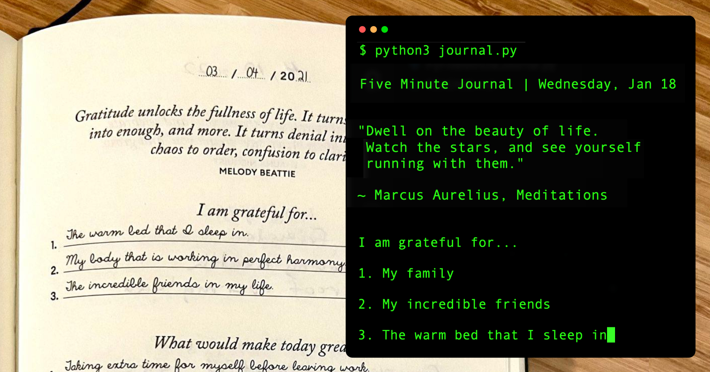

# The Python Five Minute Journal

A simple Python application inspired by [The Five Minute Journal - Intelligent Change](https://www.intelligentchange.com/products/the-five-minute-journal).



## Read the article featured on Hashnode
[brignoni.dev/the-python-five-minute-journal](https://brignoni.dev/the-python-five-minute-journal)

---

## Requirements
* Python >=3.7
* pip
* requests
* python-dotenv==0.21.0
* Jinja2==3.1.2

### Installation

```
pip install -r requirements.txt
```

### Start your daily Five Minute Journal
In the morning run the command. Running it again in the evening will give you a different set of questions.

```
python3 journal.py
```

Your journal markdown files will be saved in the `journals` directory.

```
2022/5MJ-2022-12-31.md
2023/5MJ-2023-01-01.md
2023/5MJ-2023-01-02.md
2023/5MJ-2023-01-02.md
2023/5MJ-2023-01-04.md
2023/5MJ-2023-01-05.md
```

The Markdown file.

```markdown

Five Minute Journal | Wednesday, Jan 18 2023

> Dwell on the beauty of life. Watch the stars, and see yourself running with them.
> 
> ~ Marcus Aurelius, Meditations

---
07:55 AM

### I am grateful for...
1. My family
2. My incredible friends
3. The warm bed that a sleep in

### What would make today great?
1. Walk around the park
2. Go to the coffeeshop
3. Publish this blog article

### Daily affirmations
1. I traveled to Portugal
2. I am grateful for everything I have
3. I am a better Software Engineer than yesterday

---
09:05 PM

### Highlights of the day
1. Had breakfast with family
2. Met a friend at the coffeeshop
3. Practiced Portuguese with my language partner

### What did I learn today?
1. New Portuguese vocabulary
2. Completed an AWS hands-on lab
3. Studied for AWS Certified SysOps Admin Associate

```

## Environment Variables
To customize some behaviors, copy the `.env.example` file and rename it to `.env`. For example, you can set the locale to Portuguese.

```yml
# .env
LOCALE=pt
```

These are the available variables.

```yml
# .env.example
LOCALE=en
TITLE="Five Minute Journal"
NAMESPACE="5MJ"
DEFAULT_ANSWER_COUNT=3
HEADER_TEMPLATE="header-template.md"
QUESTION_TEMPLATE="question-template.md"
OUTPUT_DIR="journals"
```

## Available Locales
- English (en) | Default
- Portuguese (es)
- Spanish (es)
- Swedish (sv) | Thanks [@SambhaviPD](https://github.com/SambhaviPD)

## Contributing
Pull requests are welcome. For major changes, please open an issue first to discuss what you would like to change.

<!-- Please make sure to update tests as appropriate. -->
<!-- @todo Add tests -->

## Contributing a locale
1. Copy the locale template `locales/journal.[locale].yml`.
2. Substitute the placeholders and translations.
3. Send a pull request.

```yml
# locales/journal.pt.yml
pt:
  title: Diário de Cinco Minutos
  complete: Já está completo!
  saved: O diário de hoje foi salvo
  questions:
    i_am_grateful_for: Estou agradecido por...
    what_would_make_today_great: O que é que hoje em dia seria óptimo?
    daily_affirmations: Afirmações diárias
    highlights_of_the_day: Destaques do dia
    what_did_i_learn_today: O que é que aprendi hoje?
```

## License
[MIT](https://choosealicense.com/licenses/mit/)